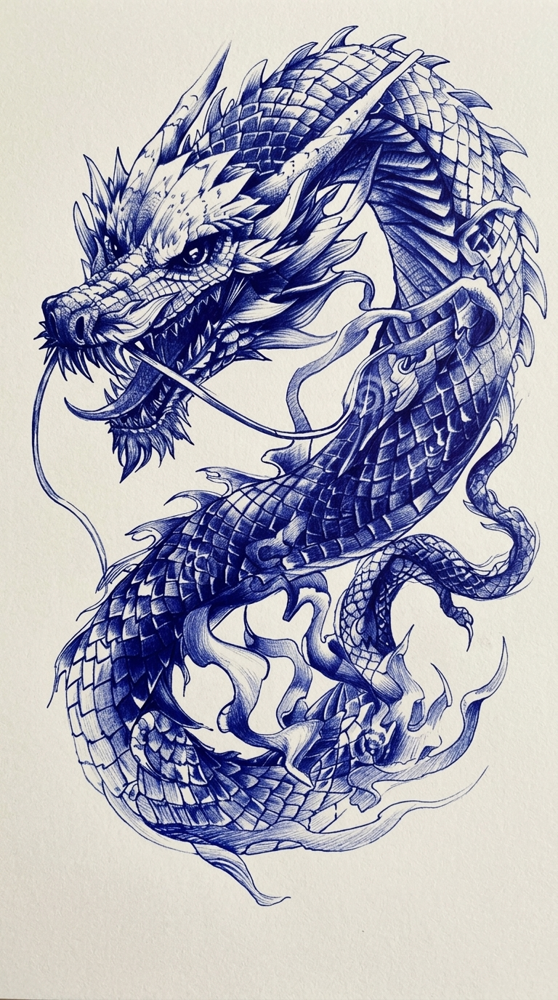
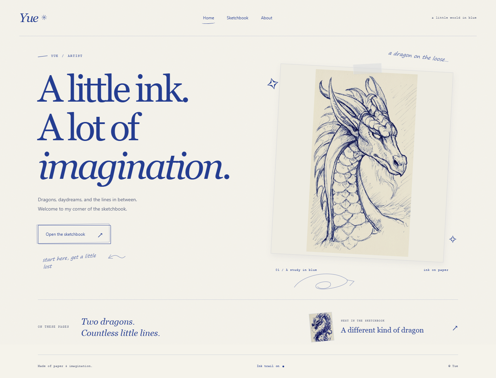
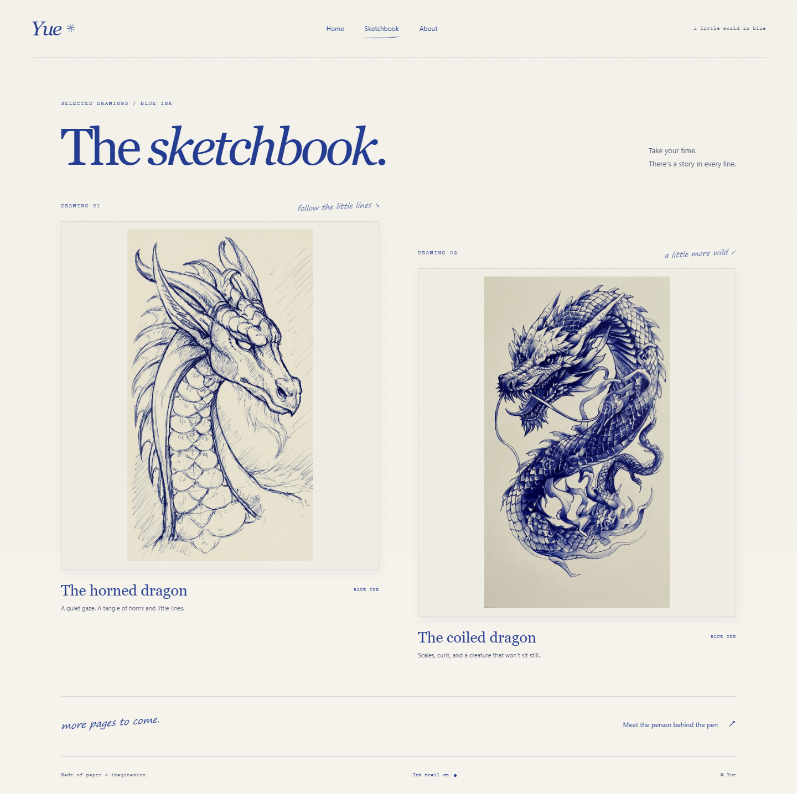
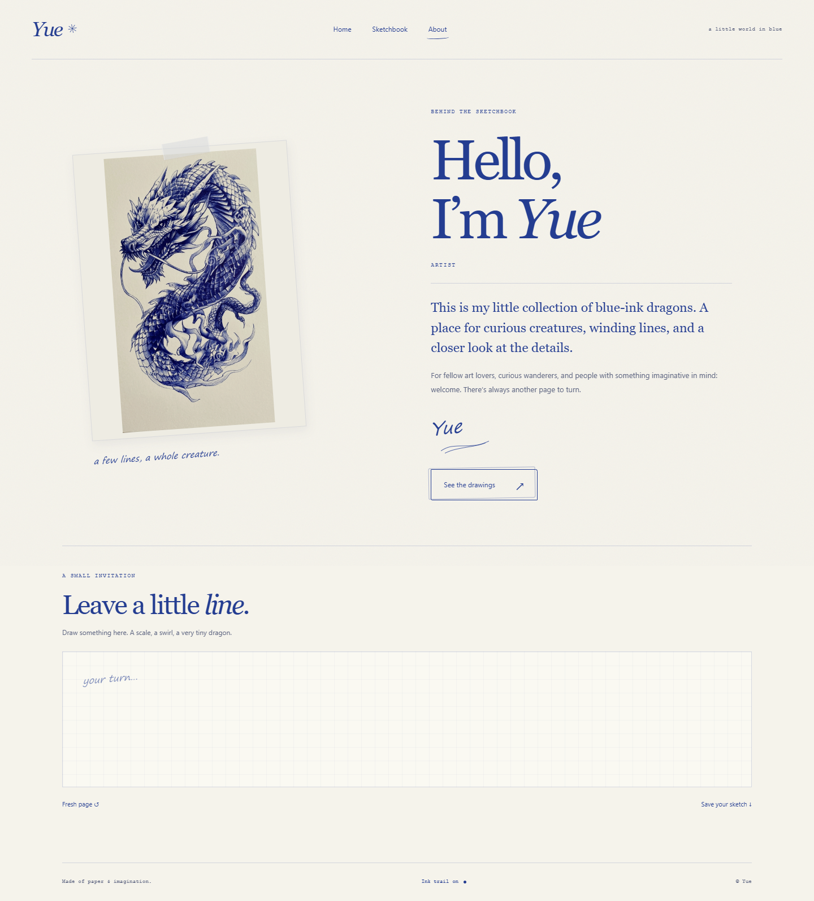
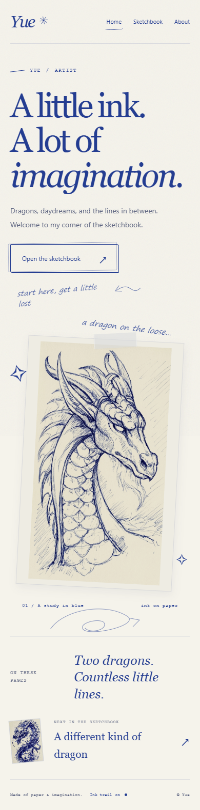

<div align="center">



# Canvas Design

**Give your interface a point of view.**

A creative-direction skill that turns a rough idea into a clear brief, fitting artwork, and a distinctive website, web app, mobile app, or desktop interface.

Adaptive discovery · Art direction · Image planning · Master prompts · App and website building · Visual review

</div>



## About

“Make me a portfolio with a dragon pencil design” can mean many different things. Canvas Design helps an AI assistant find the right interpretation before it commits to a layout.

It asks focused questions when important context is missing, offers concrete directions when you are unsure, and proceeds when the brief is clear. It connects your audience, content, visual concept, imagery, and interactions into one coherent direction.

The result can be a **complete master prompt**, a **working website or app**, or both, depending on what you ask for. The skill does not impose a blue palette, a sketchbook look, a particular framework, or elaborate effects on every project.

## What it does

| Capability | How it helps |
| --- | --- |
| Adaptive discovery | Asks a few useful questions at a time and skips what you already answered. |
| Creative direction | Connects the product's purpose to its structure, typography, imagery, materials, and behavior. |
| Asset direction | Plans images for their actual placement, including composition, negative space, and mobile crops. |
| Image generation | Uses an available image tool when requested, or provides ready-to-use image prompts if generation is unavailable. |
| Master prompts | Produces a self-contained, project-specific brief another builder can use. |
| Implementation | Builds within your chosen stack and constraints, using techniques that fit the intended behavior. |
| Platform guidance | Adapts navigation, layout, input, resources, and review to browser, mobile, or desktop delivery. |
| Visual review | Checks the actual result against the brief, including adaptive layouts and meaningful interactions. |

## Install

Using the [Skills CLI](https://github.com/vercel-labs/skills):

```sh
npx skills add Yuezhiui/canvas-design --skill canvas-design
```

For a manual Codex installation, copy the complete [`skills/canvas-design`](skills/canvas-design) folder into `~/.codex/skills/canvas-design`. Keep its `references` and `agents` folders together with `SKILL.md`.

The portable instructions live in [`SKILL.md`](skills/canvas-design/SKILL.md). Your assistant must support loading skills or be given those instructions directly. Image generation, browser previews, and implementation depend on the tools available in your environment.

## Use

In Codex, invoke the skill with `$canvas-design` and describe the result you want:

```text
$canvas-design Create a simple three-page portfolio with blue dragon
sketches, sketch-style hover effects, and a fading blue mouse trail.
Use HTML, CSS, and JavaScript. Help me resolve any important missing context.
```

For a prompt instead of a build:

```text
$canvas-design Help me develop the direction for my portfolio, then
write a complete master prompt for another website builder.
```

For missing artwork:

```text
$canvas-design I don't have images. Plan and generate illustrations
that fit the concept and the places they will appear on the page.
```

You do not need to know design terminology. Explain what you want to achieve, share what you have, and let the skill help clarify the direction. If you already have a complete brief, it should work from that rather than interview you again.

## Websites, web apps, mobile, and desktop

Canvas Design shares one discovery and creative-direction process, then loads only the relevant platform guidance. It preserves your framework and distinguishes a responsive website, a native app, and an agreed prototype.

| Surface | Guidance included |
| --- | --- |
| Websites | Content hierarchy, artwork, page composition, responsive layout, and meaningful motion. |
| Browser web apps | Task flows, routes and browser history, forms, loading/empty/error states, and real versus demo data. |
| Mobile apps | Touch, navigation/back behavior, safe areas, keyboard avoidance, text scaling, and relevant persistence/lifecycle behavior. |
| Desktop applications | Resizable windows, density, focus, shortcuts, native resources, editing states, and UI-thread responsiveness. |

Focused toolkit notes cover **Flutter, .NET MAUI, Avalonia, JavaFX, and Swing**. Other toolkits can use the shared method with their official documentation. This is design and implementation guidance, not a replacement for framework expertise, installed SDKs, or actual target testing.

```text
$canvas-design Build a Flutter journal for Android with a blue dragon
sketch theme. Entries should save locally and work offline. Help me
resolve any important missing context before implementing it.
```

```text
$canvas-design Design and implement an Avalonia desktop organizer.
Keep the existing ViewModels and theme. Prioritize fast keyboard
operation and a usable layout when the window is resized.
```

```text
$canvas-design Write a complete master prompt for a JavaFX inventory
app. Specify the main workflows and states; do not implement it yet.
```

If the request is vague, the skill asks a few consequential questions. If the task, platform, content, and constraints are already clear, it proceeds. App discovery focuses on what users must accomplish and which actions really work; it does not automatically add login, a backend, or notifications.

## Existing skills used as research references

| Reference | What informed this extension |
| --- | --- |
| [Flutter Agent Plugins](https://github.com/flutter/agent-plugins) | Adaptive layout and routing guidance maintained by the Flutter team. |
| [Vercel web-design-guidelines](https://github.com/vercel-labs/agent-skills/blob/main/skills/web-design-guidelines/SKILL.md) | Browser interface, focus, form, and semantic-control checks. |
| [David Ortinau's MAUI skills](https://github.com/davidortinau/maui-skills) | Distinct mobile and desktop input ergonomics. |
| [Wieslaw Soltes's Avalonia development plugin](https://github.com/wieslawsoltes/development-plugin-for-avalonia) | Reusable styling resources, shell design, and intentional theme selection. |

The extension uses original instruction writing and source attribution. These collections are optional references, not installed dependencies. JavaFX and Swing implementation notes use official documentation. See [research and provenance](skills/canvas-design/references/sources.md) for exact files, licensing evidence, and limitations.

## Dragon sketchbook example

The example began with two blue-ink dragon drawings and a request for a simple website. Discovery established a personal portfolio for **Yue**, aimed at art lovers and collaborators, with the supplied drawings featured as original work.

The resulting three-page site uses warm paper, blue ink, readable typography, small handwritten notes, and a restrained layout. The artwork sets the visual direction; the interface gives it room.

| Page | Included behavior |
| --- | --- |
| Home | Featured dragon, sketchbook navigation, sketch hover marks, and a fading mouse trail. |
| Sketchbook | Both drawings, keyboard-accessible enlarged views, and image downloads. |
| About | Introduction and an optional drawing pad with clear and PNG export controls. |

The example uses **plain HTML, CSS, and JavaScript** with no framework, external fonts, or build step. The trail can be switched off and is disabled for touch input and reduced motion. Contact details are empty by default; the name and role can be edited in `profile.js`.

### Run the example

Open [`examples/dragon-portfolio/index.html`](examples/dragon-portfolio/index.html) in a browser, or run a local server:

```sh
cd examples/dragon-portfolio
python -m http.server 4173 --bind 127.0.0.1
```

Then visit `http://127.0.0.1:4173`.

### More previews



<details>
<summary>About page and mobile layout</summary>





</details>

## Design principles

- **Specificity before spectacle.** A concept needs concrete visual and behavioral decisions, not a string of adjectives.
- **Context before defaults.** Audience, identity, tasks, and content should shape the interface.
- **A coherent visual world.** Imagery, typography, surfaces, and interactions should belong together.
- **Useful originality.** Decorative effects should support the experience; novelty alone is not quality.
- **Honest content.** Generated artwork must not masquerade as real projects, clients, testimonials, or personal facts.
- **Evidence over promises.** Inspect and test the result. Good prompts do not guarantee good design.

Cards, gradients, serif fonts, and centered layouts are not universally banned. Their purpose and execution matter more than a checklist of fashionable prohibitions.

## Repository structure

```text
skills/canvas-design/
  SKILL.md                     Core workflow
  agents/openai.yaml           Codex interface metadata
  references/
    discovery.md               Adaptive interview guide
    master-prompt.md           Tailored prompt guidance
    assets-and-review.md       Image direction and visual checks
    web-apps.md                Browser workflows and delivery
    mobile-apps.md             Handheld workflows and Flutter notes
    desktop-apps.md            Windowed apps and native toolkit notes
    sources.md                 Research provenance and limitations
tests/scenarios.md            Manual routing/discovery walkthroughs
examples/dragon-portfolio/     Complete three-page website
demo/                         Desktop and mobile screenshots
```

## Validation

The skill package passed metadata and reference-link validation. The dragon example was checked in Chrome for desktop and 320/390px layouts, asset and navigation loading, hover marks, trail painting and fading, trail preference persistence, keyboard dialog access, drawing export and clearing, and reduced-motion behavior. These checks are evidence for this example, not a guarantee for every site generated with the skill.

The platform extension passed package/link checks and manual walkthroughs for representative web, mobile, desktop, and prompt-only requests; see [scenarios](tests/scenarios.md). Those are instruction-level checks. Native implementations for the listed toolkits have not yet been validated end to end; builds and device/window reviews must be performed in the environment of each future project.

Dragon illustrations supplied by Yue. The example preserves the original artwork files.

## License

[MIT License](LICENSE) · Copyright (c) 2026 Koshi.
